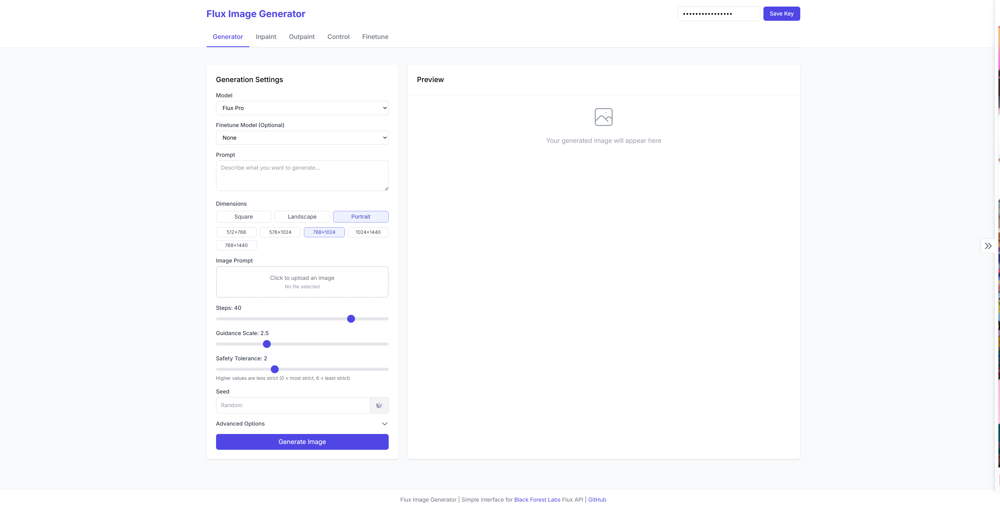

# Flux UI

A comprehensive web-based interface for the Black Forest Labs Flux AI API, providing a user-friendly way to generate images, manage finetunes, and perform various image editing tasks.



## Table of Contents

- [Overview](#overview)
- [Features](#features)
- [Architecture](#architecture)
- [Setup](#setup)
  - [Prerequisites](#prerequisites)
  - [Installation](#installation)
  - [Running Locally](#running-locally)
  - [Docker Setup](#docker-setup)
- [Usage Guide](#usage-guide)
  - [Generator Tab](#generator-tab)
  - [Inpaint Tab](#inpaint-tab)
  - [Outpaint Tab](#outpaint-tab)
  - [Control Tab](#control-tab)
  - [Finetune Tab](#finetune-tab)
  - [Gallery](#gallery)
  - [Dark Mode](#dark-mode)
- [Technical Details](#technical-details)
  - [API Integration](#api-integration)
  - [Proxy Server](#proxy-server)
  - [Image Storage](#image-storage)
- [Security Considerations](#security-considerations)
- [Contributing](#contributing)
- [License](#license)

## Overview

Flux UI is a feature-rich interface for Black Forest Labs' Flux AI image generation API. It simplifies the process of creating and editing AI-generated images through an intuitive web interface, handling all the complex API interactions behind the scenes. This application provides access to various Flux models, including support for fine-tuning, inpainting, outpainting, and controlled image generation.

## Features

- **Multiple Model Support**: Access to all Flux models with their specific parameters:
  - **Flux Pro 1.1**: Latest stable model with excellent quality and speed
  - **Flux Pro**: Standard professional model
  - **Flux Dev**: Development model
  - **Flux Ultra**: High-quality model with aspect ratio control
  - **Flux Kontext Pro**: High-quality model with aspect ratio control and image editing
  - **Flux Kontext Max**: High-quality model with aspect ratio control and image editing

- **Image Generation**: Create images using text prompts with fine-grained control over:
  - Dimensions or aspect ratios
  - Guidance strength
  - Steps count
  - Safety tolerance
  - Seed values (for reproducibility)
  - Optional image prompting (remix)

- **Finetune Management**: Create and use custom finetuned models:
  - Upload training data in ZIP format
  - Configure training parameters
  - Manage existing finetunes
  - View detailed finetune information
  - Apply finetunes to image generation with adjustable strength

- **Advanced Image Editing**:
  - **Inpainting**: Edit specific parts of an image by drawing a mask
  - **Outpainting**: Extend images beyond their original boundaries in any direction

- **Control-Based Generation**: Generate images using control images:
  - **Canny Edge Detection**: Generate images from edge maps
  - **Depth Maps**: Generate images guided by depth information

- **Integrated Gallery**: Browser-based storage for generated images:
  - Save generated images automatically
  - Preview images with their generation parameters
  - Download images in various formats
  - Copy images to clipboard
  - Use gallery images as input for inpainting, outpainting, or control

- **Advanced Options**: Fine-tune the generation process with:
  - Prompt upsampling (automatic enhancement)
  - Output format selection (JPEG/PNG)
  - Raw mode for Ultra model
  - Interval parameter control for Pro model

- **Dark Mode**: Toggle between light and dark themes for comfortable use in any environment

- **API Key Management**:
  - Securely store API key in browser's localStorage
  - Easily clear stored API key when needed

## Architecture

Flux UI consists of two main components:

1. **Frontend**: A browser-based UI built with vanilla JavaScript, HTML, and CSS:
   - Modular tab-based interface
   - IndexedDB for client-side image storage
   - Canvas-based image editing

2. **Backend**: A lightweight Node.js Express server that:
   - Serves static frontend files
   - Acts as a proxy to the Black Forest Labs API
   - Handles image caching and CORS issues

The application is designed to run entirely in the browser with minimal server requirements, storing all images and settings in the browser's local storage and IndexedDB.

## Setup

### Prerequisites

- Node.js 14.0.0 or higher
- npm or yarn
- A Black Forest Labs API key (get one at https://blackforestlabs.ai)

### Installation

1. Clone this repository:
   ```bash
   git clone https://github.com/Tremontaine/flux-ui.git
   cd flux-ui
   ```

2. Install dependencies:
   ```bash
   npm install
   ```

### Running Locally

1. Start the server:
   ```bash
   npm start
   ```

2. Open `http://localhost:3589` in your browser.

3. Enter your BFL API key in the header input field and click "Save Key".

### Docker Setup

Flux UI can be easily deployed using Docker:

1. Build and run using Docker Compose:
   ```bash
   docker-compose up -d
   ```

2. Or build and run the Docker image directly:
   ```bash
   docker build -t flux-ui .
   docker run -p 3589:3589 flux-ui
   ```

3. Access the application at `http://localhost:3589`

## Usage Guide

### Generator Tab

The Generator tab is the primary interface for creating images from text prompts.

**Key Features:**
- **Model Selection**: Choose between Flux Pro 1.1, Flux Pro, Flux Dev, and Flux Ultra.
- **Finetune Support**: Apply a finetune model with adjustable strength.
- **Dimension Control**: Select from various preset dimensions or aspect ratios (model dependent).
- **Image Prompt**: Upload an image to influence the generation (useful for style or content transfer).
- **Advanced Parameters**: Fine-tune the generation with sliders for steps, guidance, and safety.
- **Seed Control**: Use specific seeds for reproducible results or randomize.

**Workflow:**
1. Select your preferred model
2. Enter a descriptive prompt
3. Choose dimensions or aspect ratio
4. Adjust parameters as needed
5. Optionally add an image prompt
6. Click "Generate Image"
7. Your image will appear in the preview area and be saved to the gallery automatically

**Model-Specific Features:**
- **Flux Ultra**: Uses aspect ratios instead of fixed dimensions and offers a "Raw Mode" for less processed images
- **Flux Pro**: Includes an "Interval" parameter for guidance control
- **Flux Pro 1.1**: Simplified interface without steps or guidance controls

### Inpaint Tab

The Inpaint tab allows you to edit parts of an existing image by masking areas you want to replace.

**Key Features:**
- **Interactive Masking**: Draw directly on the image to create a mask.
- **Brush Size Control**: Adjust brush size for precise masking.
- **Smart Processing**: The mask is properly scaled to the original image resolution.
- **Finetune Support**: Apply finetuned models to inpainting for consistent style.

**Workflow:**
1. Upload an image or select one from the gallery
2. Draw on the areas you want to replace (white areas will be inpainted)
3. Enter a prompt describing what should appear in the masked area
4. Adjust parameters as needed
5. Click "Generate Inpaint"
6. The result will appear in the preview area and be saved to the gallery

### Outpaint Tab

The Outpaint tab lets you extend images beyond their original boundaries, useful for expanding scenes or creating panoramas.

**Key Features:**
- **Multi-directional Expansion**: Add pixels to any combination of top, bottom, left, or right.
- **Size Preview**: Shows the original and resulting image dimensions.
- **Optional Prompt**: Guide the expansion with a text description.

**Workflow:**
1. Upload an image or select one from the gallery
2. Specify how many pixels to add to each side
3. Enter a prompt describing what should appear in the expanded areas (optional)
4. Adjust parameters as needed
5. Click "Generate Outpaint"
6. The expanded image will appear in the preview area and be saved to the gallery

### Control Tab

The Control tab enables generating images based on structural inputs like edge maps or depth maps.

**Key Features:**
- **Multiple Control Types**: Support for Canny Edge Detection and Depth Map.
- **Parameter Adjustments**: Fine-tune the control processing (e.g., Canny thresholds).
- **Finetune Compatibility**: Apply finetuned models to maintain style consistency.

**Workflow:**
1. Select a control type (Canny Edge or Depth Map)
2. Upload a control image or select one from the gallery
3. Enter a prompt describing the desired output
4. Adjust control-specific parameters
5. Click "Generate Image"
6. The result will appear in the preview area and be saved to the gallery

### Finetune Tab

The Finetune tab manages custom finetuned models that adapt the Flux AI to specific styles, characters, or products.

**Key Features:**
- **Finetune Creation**: Upload training data and configure training parameters.
- **Finetune Management**: View, use, and delete your existing finetunes.
- **Detailed Information**: Access technical details about each finetune.
- **Multiple Modes**: Support for character, style, product, and general finetuning.

**Workflow for Creating a Finetune:**
1. Prepare a ZIP file containing your training images (and optional captions)
2. Upload the ZIP file
3. Enter a name/comment for your finetune
4. Configure trigger word, mode, and other parameters
5. Click "Start Finetuning"
6. The finetune will be processed on the server (this may take time)
7. Once complete, it will appear in your finetunes list

**Finetune Modes:**
- **General**: For learning overall image characteristics
- **Character**: Optimized for consistent character appearance
- **Style**: Focused on artistic style elements
- **Product**: Specialized for product visualization

### Gallery

The Gallery is a sidebar feature that stores all generated images locally in your browser.

**Key Features:**
- **Automatic Saving**: All generated images are saved automatically.
- **Parameter Storage**: Each image stores its generation parameters.
- **Image Actions**: Download, copy to clipboard, view full size.
- **Integration**: Send images to other tabs for inpainting, outpainting, or control.
- **Persistent Storage**: Images remain available between sessions (uses IndexedDB).

**Usage:**
- Toggle the gallery visibility using the button on the right side of the screen
- Click on an image to view it full size with all parameters
- Use the "Use for..." buttons to send an image to another tab

### Dark Mode

Flux UI includes a dark mode for comfortable use in low-light environments:

- Toggle between light and dark themes using the icon in the header.
- Your preference is saved automatically and persists between sessions.
- Dark mode reduces eye strain and can save battery life on certain devices.

## Technical Details

### API Integration

Flux UI integrates with the Black Forest Labs API (documented at https://api.us1.bfl.ai) through a proxy server. The application handles:

- Authentication using API keys
- Task submission to various endpoints
- Polling for results
- Error handling and retries
- Parameter validation and formatting

The API integration is managed through a modular system in `public/js/api.js`, which exposes a `FluxAPI` object with methods for:
- `makeRequest`: Sending requests to specific endpoints
- `pollForResult`: Monitoring generation progress
- `getProxiedImageUrl`: Managing cross-origin image access
- `getMyFinetunes`: Retrieving user's finetune list

### Proxy Server

The Node.js Express server in `server.js` acts as a proxy to:
1. Avoid CORS issues with the Flux API
2. Provide image proxying for displaying results
3. Hide API key details from network monitoring tools
4. Enable easier deployment behind firewalls

The server handles:
- POST requests to various API endpoints
- GET requests for polling results
- Image proxying with proper caching
- Static file serving

### Image Storage

Images are stored locally in the browser using:
- **IndexedDB**: For long-term storage of images and metadata
- **Object URLs**: For efficient display of stored images
- **File API**: For handling image uploads and downloads

The gallery component (`public/js/gallery.js`) manages this storage with features like:
- Automatic cleanup of old images when exceeding storage limits
- Metadata storage alongside images
- Conversion between formats for display and storage

## Security Considerations

This application handles your Black Forest Labs API key and image data. It's important to understand exactly how this data is managed:

- **API Key Storage**: Your API key is stored in your browser's localStorage. While this provides persistence between sessions, be aware that localStorage is not encrypted. The key is accessible to any JavaScript running on the same domain. The UI masks the key with bullets after saving, but the actual key remains in localStorage in plaintext.

- **API Key Transmission**: When making requests to the BFL API, your API key is sent from your browser to the local proxy server (running on your machine or your deployment), and then from the proxy to the BFL API. The key is transmitted in HTTP headers. If you're running the application locally, this traffic stays on your machine. If deployed, ensure you use HTTPS to encrypt this traffic.

- **API Key Management**: The application provides a "Clear Key" button to remove your API key from localStorage when needed, enhancing security on shared devices.

- **Proxy Server Function**: The Node.js server included with this application acts as an intermediary between your browser and the BFL API. It forwards your requests and API key to BFL, and returns the responses to your browser. This proxy primarily exists to bypass CORS restrictions and provide image proxying capabilities, not as a security measure.

- **Data Processing Location**: 
  - All image editing operations (masking, canvas manipulations) happen entirely in your browser.
  - The actual image generation is performed by the BFL API on their servers.
  - This means your edited images, masks, and prompts are sent to the BFL API during generation.

- **Local Data Storage**: Generated images and their associated metadata (including prompts and parameters) are stored in your browser's IndexedDB. This data persists between sessions but remains on your device.

- **Data Sharing Limitations**: The application only shares data with the BFL API as needed for image generation. It does not upload your images or parameters to any other external services. However, be mindful that your prompts and input images are sent to BFL's servers during the generation process.

- **Network Requests**: You can verify all network requests made by this application using your browser's developer tools. All API requests should go to either the local proxy server or directly to BFL endpoints if configured to do so.

- **Limitations**: This application does not implement end-to-end encryption or advanced security features. Your security depends partly on the security of your browser, your local system, the BFL API, and (if deployed remotely) your deployment platform.

## Contributing

Contributions are welcome! Please feel free to submit a Pull Request or open an Issue for bugs and feature requests.

To contribute:
1. Fork the repository
2. Create your feature branch (`git checkout -b feature/amazing-feature`)
3. Commit your changes (`git commit -m 'Add some amazing feature'`)
4. Push to the branch (`git push origin feature/amazing-feature`)
5. Open a Pull Request

## License

This project is open source and available under the [MIT License](LICENSE).

---

© 2025 Tremontaine. All rights reserved.
